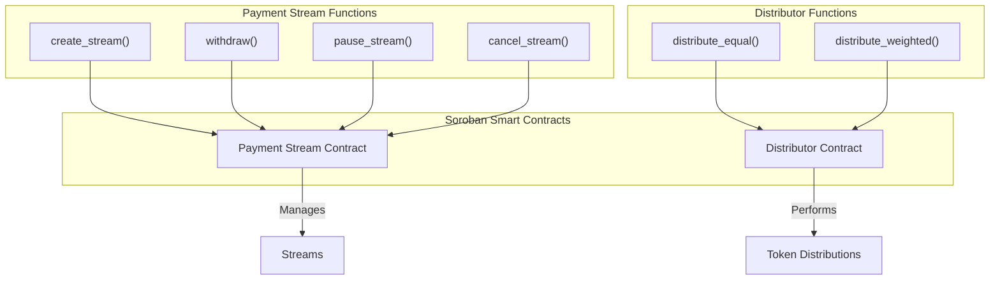

# Architecture

This document provides a high-level overview of the Fundable Stellar project's architecture, which is composed of three main parts: a web frontend, a TypeScript SDK, and Soroban smart contracts.

## High-Level Architecture

The following diagram illustrates the interaction between the main components of the system:

```mermaid
graph TD
    A[User] --> B{Frontend (Next.js)};
    B --> C{SDK (@fundable/sdk)};
    C --> D{Soroban Smart Contracts};
    D --> E((Stellar Blockchain));

    subgraph "Client-Side"
        A
        B
    end

    subgraph "Off-Chain"
        C
    end

    subgraph "On-Chain"
        D
        E
    end
```

### Components

-   **Frontend (Next.js):** The user-facing web application that allows users to interact with the Fundable Protocol.
-   **SDK (@fundable/sdk):** A TypeScript library that abstracts the communication with the Soroban smart contracts, providing a simple API for the frontend.
-   **Soroban Smart Contracts:** The on-chain logic that governs payment streams and token distribution.
-   **Stellar Blockchain:** The underlying blockchain where the smart contracts are deployed and transactions are recorded.

## Contract Architecture

The smart contract layer is composed of two main contracts, organized as a Cargo workspace.



### Contracts

-   **Payment Stream Contract:** Manages the lifecycle of payment streams, including creation, withdrawal, pausing, and cancellation.
-   **Distributor Contract:** Handles the distribution of tokens to multiple recipients, with support for both equal and weighted distributions.
